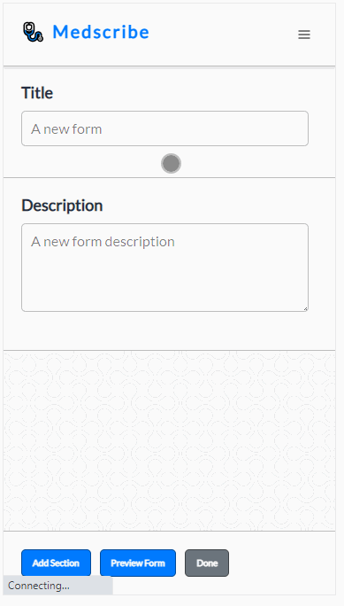

# Medscribe: A healthcare patient intake prototype

This is a project showing my personal development practices. Feel free to
browse around and check out the code.

It is designed to help a clinician digitize their patient intake process, and
allow them to create a fully customizable online form that is usable on a wide
variety of device sizes.

## Goals

- Well contained development cycle: 1 sprint, roughly 10 8-hour days
- Use best practices and create a consise and beautiful frontend using React
- Create a simple, scalable backend using microservices and AWS (serverless)
- Keeping the markup and css modern and lightweight, focus on flexbox
- Reponsive design using scss templated media queries
- Good evergreen browser compatibility

## Features

- [x] React-based front-end with scss modules
  - [x] View individual form
  - [x] Edit invididual form
  - [x] View list of forms
  - [x] View list of responses
  - [x] View individual reponse
  - [ ] User authentication and sign-in
- [x] JSONServer prototype back-end
  - [x] Forms
  - [x] Form responses
- [ ] Node.js microservices to replace JSONServer
  - [ ] Forms
  - [ ] Form responses
  - [ ] Accounts/authentication (JWT/bcrypt w/ work factor)
  - [ ] serverless framework deploy on AWS via lambdas
  - [ ] DynamoDB back-end, local dynamodb for dev

## Screencasts

### A clinician can create a new intake form

### A clinician can preview their intake

### A clinician can review all responses to forms

### Desktop styling

